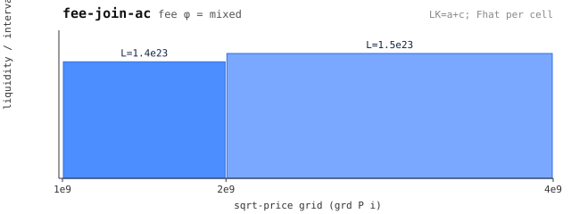

# pj — joint pool = pool_fee_join(pa, pc) (leg 3)

 — liquidity per grid interval (generated: `make charts`)

The heterogeneous-fee join: pa (fee 0.3%) + pc (fee 0.5%) merged on the
shared grid `[1, 2, 4]e9`. The joint fee is derived from both legs' fee
books — this is the AFP model's answer to "what fee does a join of
different-fee pools charge".

Exercises: `join` (swap through pj, byte-exact vs pins), `inside-join`
(interior entry). Regenerate with `python3 gen.py`.
