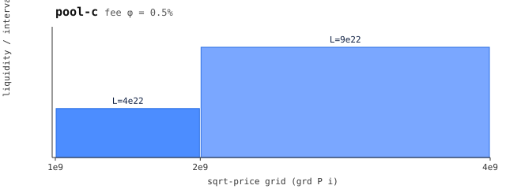

# pc — pool C (leg 3, heterogeneous fees)

 — liquidity per grid interval (generated: `make charts`)

Grid = pa's `[1, 2, 4]e9`, fee **0.5%** (`5e15/1e18`) — the fee contrast
against pa (0.3%) is the point: this leg checks joins where the two pools
charge different fees.

Exercises: `join`, `inside-join`. Regenerate with `python3 gen.py`.
