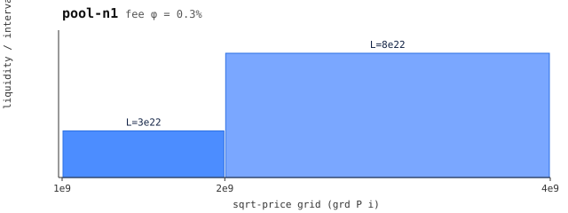

# n1 — pool N1 (leg 4, N-pool composition)

 — liquidity per grid interval (generated: `make charts`)

Grid = pa's `[1, 2, 4]e9`, liquidity `[3e22, 8e22]`, fee 0.3% (same fee as
pa — leg 4 composes equal-fee pools). The AFP entry only defines PAIRWISE
joins; n1/n2/splt3 are this port's N-ary generalization, verified by pins +
exhaustive split sweeps rather than a theorem.

Member of the `splt3` optimum: the 3-way splitter equalizes ending price
across pa + n1 + n2. Exercises: `npool-over`, `npool-two`, `npool-star`,
`npool-under`, `opt-n`. Regenerate with `make regenerate` (generator: `generators/gen3.py`).
