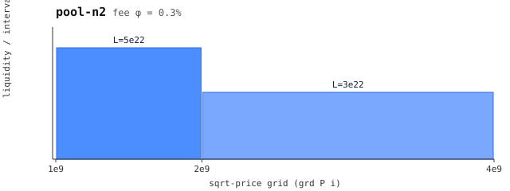

# n2 — pool N2 (leg 4, N-pool composition)

 — liquidity per grid interval (generated: `make charts`)

Grid = pa's `[1, 2, 4]e9`, liquidity `[5e22, 3e22]` — descending liquidity
curve, the third member of the composition. Fee 0.3% (equal-fee leg).

Exists so `splt3` has a three-way allocation problem worth optimizing: the
optimum split depends on all three pools' curves, and no pairwise chain can
beat it (verified beyond `VIOLWIN = 2*N` dust). Same scenario set as n1.
Regenerate with `make regenerate` (generator: `generators/gen3.py`).
