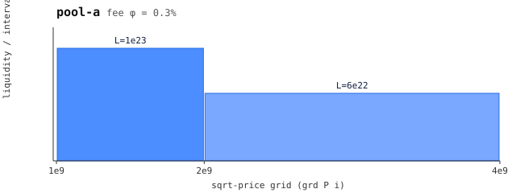

# pa — pool A (leg 2 baseline)

 — liquidity per grid interval (generated: `make charts`)

Grid `[1, 2, 4]e9`, liquidity `[1e23, 6e22]`, fee 0.3% (`3e15/1e18`).

The baseline pool of the pool-combination leg: every theorem compares a
combined pool against quoting `pa` directly. Exercises: `exact`, `inside`,
`cross`, `offgrid`, `opt-exact`, `opt-cross`, `opt-offgrid` (and the TS twins
of the same). Regenerate with `make regenerate` (from `port/`) — do not hand-edit
`src/main.lisp` constants.
