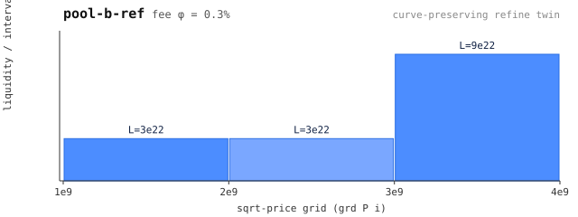

# pool-b-ref — refine(pool-b) @2e9, curve-preserving

**Why this exists:** the slippage-invariance pin. `finer_quote_slippage` /
`finer_base_slippage` (AFP): refining a pool's grid leaves the curve — and
therefore slippage — **unchanged**. This is pool-b with its [1,3]e9 cell cut
at 2e9, **L carried across the cut** (the lemma's same-curve hypothesis; NOT
the join's width-proportional L-split — a different object).

The `slip` scenario swaps the same y through both pools: identical ending
price (exact) and outputs equal to the yocto here — the telescoping identity
L*(1/p1-1/p3) = L*(1/p1-1/p2) + L*(1/p2-1/p3) holds over integers.

Carries `swap-b` like every pool (base_swap: base in, quote out).

 — liquidity per grid interval (generated: make charts)
